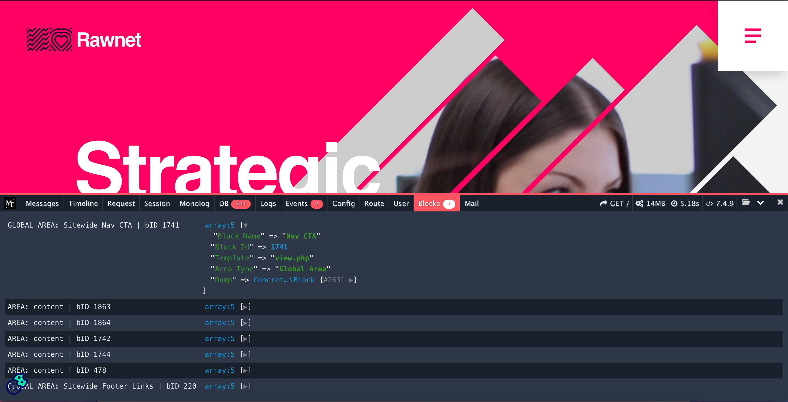

# C5 Profiler



The is the missing profiler for C5 and an extension of http://phpdebugbar.com/

### Introduction
Concrete 5.8 and PHP7.4+ compatible add-on to analyze in realtime system and performance information

### Installation

There are 2 ways to install this package

##### Copy and Paste
Please download the repo and copy and paste the package into the packages directory.

##### Composer
You can use composer to get the latest version and keep upto date

Add this to you composer.json:

```json
"require": {
  "matt9mg/c5-profiler": "1.*",
  "slowprog/composer-copy-file": "~0.3"
},
"scripts": {
  "post-install-cmd": [
    "SlowProg\\CopyFile\\ScriptHandler::copy"
  ],
  "post-update-cmd": [
    "SlowProg\\CopyFile\\ScriptHandler::copy"
  ]
},
"extra": {
  "copy-file": {
    "vendor/matt9mg/c5-profiler": "/packages/"
  }
}
```

The copy-file /packages/ DIR location may differ per installation and which composer file location this resides, you'll need to update that accordingly.

### What does is profile?
- Custom messages
- Custom timelines
- Request information
- Session information
- Monolog
- DB Queries
- Logs
- Events
- Config
- Route
- User
- Blocks
- Mail
- Memory Usage
- Load time
- PHP version
- Comparable history

### Configuration
Upon package installation a new dashboard page is includes called /dashboard/mt_profiler, within here you can control to show the profiler and what you wish to profile. This information is stored within generated_overrides.

### Advanced configuration
If you wish to control this if the config DIR instead of using the dashboard screen you can do by adding in you config directory for the application `application/config` an mt_profiler.php. This will also honour environment based config files such as local.mt_profiler.php, staging.mt_profiler.php, production.mt_profiler.php etc.


```php
<?php
return [
    'active' => true,
    'php_info' => true,
    'profilers' => [
        'php_info' => true,
        'messages' => true,
        'time' => true,
        'memory' => true,
        'request' => true,
        'session' => true,
        'monolog' => true,
        'db' => true,
        'logs' => true,
        'env' => true,
        'events' => true,
        'config' => true,
        'route' => true,
        'user' => true,
        'blocks' => true,
        'mail' => true
    ]
];
```

### How to extend and add custom elements to the profiler?

You can add custom profiler tabs by simply listening for the event `mt_profiler_add_data_collector`

### How to contribute?
Please raise a PR.
